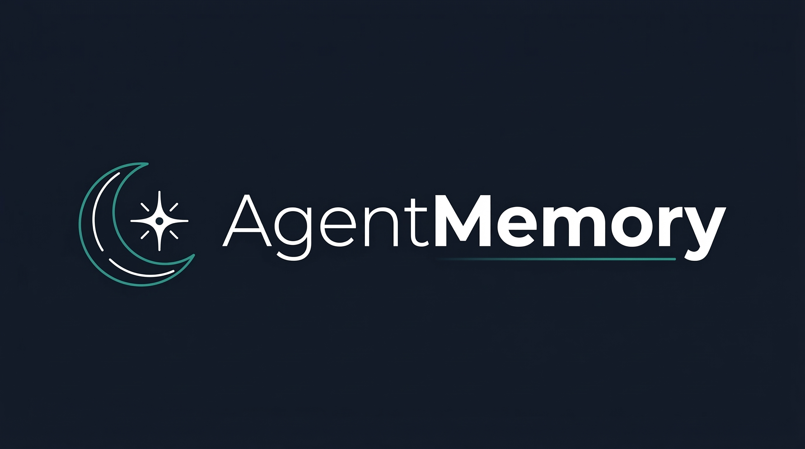
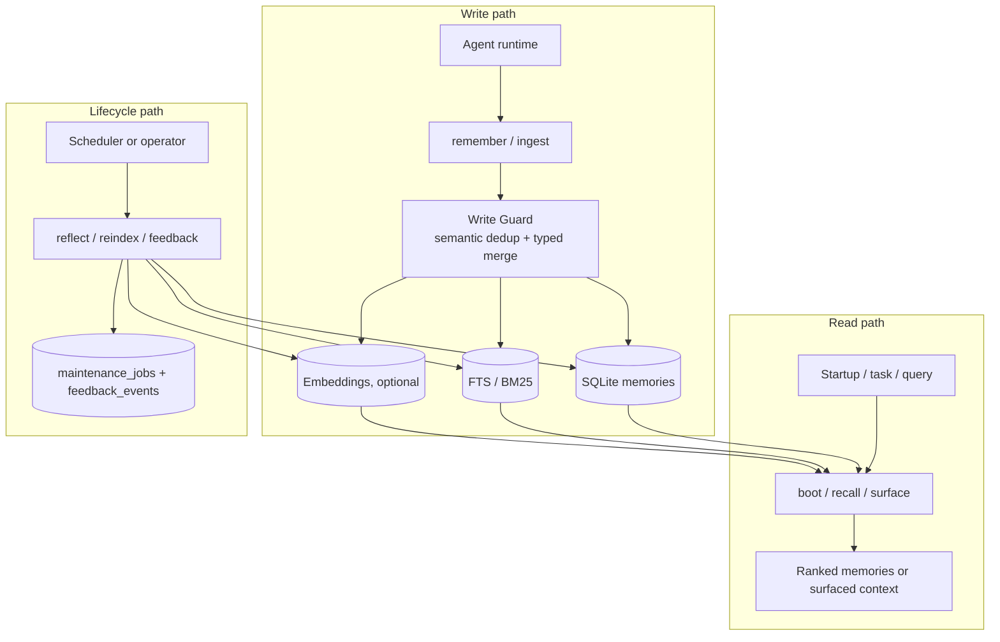
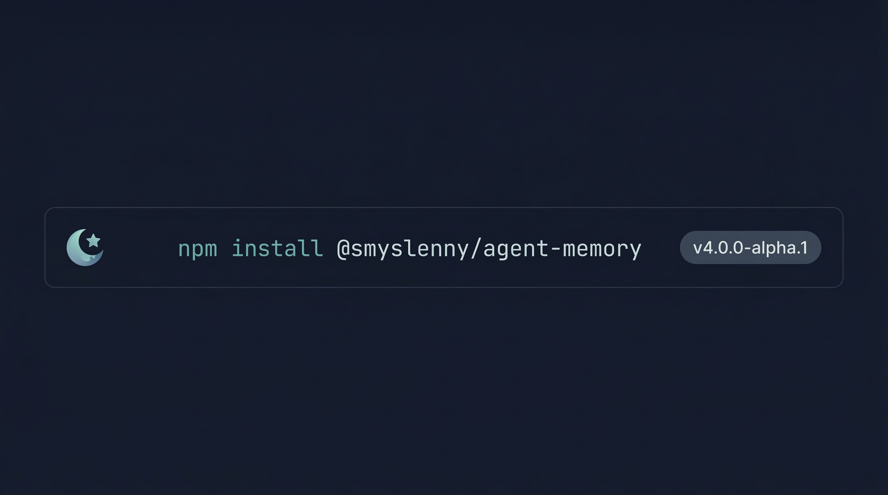

<p align="center">
  
</p>

<p align="center">
  <strong>Agent-native memory layer with lifecycle management for AI agents.</strong>
</p>

<p align="center">
  <a href="https://www.npmjs.com/package/@smyslenny/agent-memory"></a>
  <a href="LICENSE"></a>
  <a href="https://nodejs.org/"></a>
  <a href="https://modelcontextprotocol.io/"></a>
</p>

**English** | [简体中文说明](docs/README-zh.md)

AgentMemory is a SQLite-first memory layer for AI agents. It lets an agent:

- **write** durable memories with typed records, URIs, and Write Guard dedup
- **read** them back through `boot`, `recall`, and context-aware `surface`
- **maintain** them over time with `reflect`, `reindex`, and feedback signals
- **integrate** through **CLI**, **MCP stdio**, or **HTTP/SSE**

Current release: **`5.1.0`**.

Without an embedding provider, AgentMemory still works in **BM25-only mode**.
With one configured, it adds **hybrid recall** and **semantic dedup**.

## 1) What is this project?

AgentMemory is **not** a general document database and **not** a full RAG
framework. It is an **agent-native memory layer with lifecycle management**.

That means it is designed around the things agent runtimes actually need:

- a place to store durable user facts, preferences, events, and identity
- a write path that can reject duplicates or merge near-duplicates safely
- a read path for explicit lookup (`recall`) and proactive context (`surface`)
- a lifecycle path for decay, governance, reindexing, and recovery-friendly jobs
- a local-first deployment model that stays useful even without extra infra

Core building blocks:

- **Typed memories**: `identity`, `emotion`, `knowledge`, `event`
- **URI paths** for stable addressing
- **Write Guard** with semantic dedup + typed merge policy + conflict detection
- **Hybrid retrieval**: BM25 first, optional vector search
- **Memory links** with automatic association and related-memory expansion
- **Temporal recall** with time filtering and recency boost
- **Context-aware surfacing** for task/recent-turn driven context injection
- **Passive feedback** that records usage signals automatically
- **Semantic decay** that detects stale content beyond pure time-based Ebbinghaus
- **Memory provenance** for tracking where and when each memory originated
- **Archive on eviction** that preserves evicted memories for later restore
- **Tiered capacity** with per-type memory limits
- **Lifecycle jobs**: `reflect`, `reindex`, job checkpoints, feedback signals
- **Three transport modes**: CLI, MCP stdio, HTTP/SSE

### New in v5: Memory Intelligence

v5 adds six features that turn agent-memory from a durable store into an
intelligent memory layer. All features are backward-compatible — existing
v4 workflows continue to work unchanged.

| Feature | What it does |
| --- | --- |
| **F1 Memory Links** | Automatically detects semantically related memories during write and builds lightweight associations. `recall` and `surface` support `related` expansion to pull in linked memories. A new `link` tool allows manual link management. |
| **F2 Conflict Detection** | Write Guard now scans candidates for contradictions (negation, value changes, status changes). Conflicts are reported in the sync result without blocking writes. A **Conflict Override** rule ensures status updates (e.g. TODO → DONE) are not incorrectly deduplicated. |
| **F3 Temporal Recall** | `recall` and `surface` accept `after`, `before`, and `recency_boost` parameters. Time filtering happens at the SQL layer for both BM25 and vector paths. Recency boost blends a time-decay signal into the fusion score. |
| **F4 Passive Feedback** | When `recall` returns results and records access, positive feedback is automatically logged for the top-3 hits. Rate-limited to 3 passive events per memory per 24 hours. |
| **F5 Semantic Decay** | The `tidy` phase now detects stale content through keyword pattern matching (e.g. "in progress", "TODO:", "just now"). Patterns are scoped by memory type — `event` uses broad matching, `knowledge` uses anchored-start-only patterns. `identity` and `emotion` are exempt. |
| **F6 Memory Provenance** | Memories can carry `source_session`, `source_context`, and `observed_at` metadata. This tracks where and when a memory originated, separate from its write timestamp. Schema migrated from v6 → v7. |

## 2) How is it different from a vector DB, a RAG pipeline, or memory summaries?

| Thing | Good at | What AgentMemory adds |
| --- | --- | --- |
| Vector DB | Similarity search over embeddings | Write quality control, typed memory model, decay, governance, BM25 fallback, agent-scoped lifecycle |
| RAG pipeline | Retrieving external knowledge for prompts | Durable per-agent memory, surfacing, feedback, memory-specific maintenance |
| Markdown / summary files | Human-readable notes and editing | Structured retrieval, scoring, dedup, recall APIs, lifecycle operations |

A useful mental model:

- **Not a vector DB**: vectors are optional, not the product definition
- **Not a RAG pipeline**: memory is the primary object, not document chunks
- **Not just summarization**: memories can age, merge, be surfaced, and be
  governed over time

If you want a short positioning sentence:

> AgentMemory is a **memory layer for agents**, not a generic search backend.

## 3) When should I use it?

Use AgentMemory when your runtime needs one or more of these:

- **cross-session continuity** for a single agent or multiple scoped agents
- **durable preferences and facts** that should survive conversation boundaries
- **local-first deployment** with SQLite, not a mandatory external service stack
- **memory maintenance** instead of unbounded memory accumulation
- **multiple integration choices**: shell jobs, MCP tools, or HTTP services
- **optional semantic retrieval** without making embeddings mandatory

It is a strong fit for:

- personal assistants and copilots
- agentic workflows with scheduled maintenance
- multi-session chat agents
- local/offline-friendly agent runtimes
- systems that want a human-auditable memory store plus retrieval APIs

It is probably **not** the right tool if you only need:

- a high-scale standalone vector database
- classic document RAG over large corpora
- a one-shot conversation summarizer with no lifecycle management

## 4) What does the architecture look like?

Write path, read path, and lifecycle path all share the same application core.
The transport is interchangeable.



<p align="center">
  
</p>

See [docs/architecture.md](docs/architecture.md) for a deeper breakdown.

## 5) What is the shortest 5-minute setup?

<p align="center">
  
</p>

Choose the integration path that matches your runtime.

### A. CLI

```bash
npm install @smyslenny/agent-memory

export AGENT_MEMORY_DB=./agent-memory.db
export AGENT_MEMORY_AGENT_ID=assistant-demo

npx agent-memory init
npx agent-memory remember \
  "Alice prefers short weekly summaries." \
  --type knowledge \
  --uri knowledge://users/alice/preferences/summaries

npx agent-memory recall "What does Alice prefer?" --limit 5
npx agent-memory boot
npx agent-memory reflect all
```

### B. MCP stdio

```json
{
  "mcpServers": {
    "agent-memory": {
      "command": "node",
      "args": ["./node_modules/@smyslenny/agent-memory/dist/mcp/server.js"],
      "env": {
        "AGENT_MEMORY_DB": "./agent-memory.db",
        "AGENT_MEMORY_AGENT_ID": "assistant-demo",
        "AGENT_MEMORY_AUTO_INGEST": "0"
      }
    }
  }
}
```

Available MCP tools:

- `remember` — store a memory (supports provenance: `session_id`, `context`, `observed_at`)
- `recall` — hybrid search (supports `related`, `after`, `before`, `recency_boost`)
- `recall_path` — read or list memories by URI
- `boot` — load startup memories (narrative or JSON)
- `forget` — soft-decay or hard-delete a memory
- `reflect` — run sleep cycle phases (decay, tidy, govern)
- `status` — memory system statistics
- `ingest` — extract structured memories from markdown
- `reindex` — rebuild BM25 index and optional embeddings
- `surface` — context-aware readonly surfacing (supports `related`, `after`, `before`, `recency_boost`)
- `link` — manually create or remove associations between memories
- `archive` — list, restore, or purge evicted memories from the archive

### C. HTTP API

```bash
npm install @smyslenny/agent-memory
export AGENT_MEMORY_DB=./agent-memory.db
export AGENT_MEMORY_AGENT_ID=assistant-demo

npx agent-memory serve --host 127.0.0.1 --port 3000
```

```bash
curl -s http://127.0.0.1:3000/health

curl -s -X POST http://127.0.0.1:3000/v1/memories \
  -H 'content-type: application/json' \
  -d '{
    "agent_id": "assistant-demo",
    "type": "knowledge",
    "uri": "knowledge://users/alice/preferences/summaries",
    "content": "Alice prefers short weekly summaries."
  }'

curl -s -X POST http://127.0.0.1:3000/v1/recall \
  -H 'content-type: application/json' \
  -d '{"agent_id":"assistant-demo","query":"Alice summary preference","limit":5}'
```

Key HTTP routes:

- `GET /health`
- `GET /v1/status`
- `GET /v1/jobs/:id`
- `POST /v1/memories`
- `POST /v1/recall`
- `POST /v1/surface`
- `POST /v1/feedback`
- `POST /v1/reflect`
- `POST /v1/reindex`

`/v1/reflect` and `/v1/reindex` also support **SSE progress streaming**.

## 6) How do I integrate it into my agent runtime?

A good default pattern looks like this:

1. **Startup** → call `boot` to load identity / startup context
2. **Durable fact appears** → call `remember`
3. **Need an explicit lookup** → call `recall`
4. **Need relevant context before replying/planning** → call `surface`
5. **A memory was helpful or noisy** → record `feedback`
6. **Background maintenance** → run `reflect all` on a schedule
7. **Embeddings enabled or changed** → run `reindex`

Pseudo-flow:

```text
user turn -> detect durable memory -> remember
agent planning -> surface(task, recent_turns)
explicit memory question -> recall(query)
startup -> boot
nightly / periodic -> reflect(all)
provider change -> reindex
```

If you want a human-editable file workflow, treat Markdown as an **optional**
layer on top of the memory system, not the default definition of the product.
You can use `migrate` or `ingest`, or enable watcher-based ingest when your
host actually provides a workspace to watch.

## Optional semantic retrieval

Embeddings are optional. If you want hybrid retrieval or semantic dedup, set:

```bash
export AGENT_MEMORY_EMBEDDING_PROVIDER=openai-compatible
export AGENT_MEMORY_EMBEDDING_BASE_URL=https://your-embedding-endpoint.example
export AGENT_MEMORY_EMBEDDING_MODEL=text-embedding-3-small
export AGENT_MEMORY_EMBEDDING_DIMENSION=1536
export AGENT_MEMORY_EMBEDDING_API_KEY=your-api-key
```

Or use `AGENT_MEMORY_EMBEDDING_PROVIDER=local-http` for a local HTTP embedding
service. If no provider is configured, AgentMemory falls back to BM25-only.

## Environment variables

| Variable | Default | Description |
| --- | --- | --- |
| `AGENT_MEMORY_DB` | `./agent-memory.db` | SQLite database path |
| `AGENT_MEMORY_AGENT_ID` | `default` | Agent scope for multi-agent setups |
| `AGENT_MEMORY_MAX_MEMORIES` | `350` | Global fallback for maximum memories retained during `reflect govern`. Applied when no per-type limit is set. |
| `AGENT_MEMORY_MAX_IDENTITY` | _(unlimited)_ | Maximum `identity` memories retained. No limit by default. |
| `AGENT_MEMORY_MAX_EMOTION` | `50` | Maximum `emotion` memories retained. |
| `AGENT_MEMORY_MAX_KNOWLEDGE` | `250` | Maximum `knowledge` memories retained. |
| `AGENT_MEMORY_MAX_EVENT` | `50` | Maximum `event` memories retained. |
| `AGENT_MEMORY_AUTO_INGEST` | `1` | Set to `0` to disable the auto-ingest file watcher |
| `AGENT_MEMORY_AUTO_INGEST_DAILY` | _(unset)_ | Set to `1` to include daily log files (`YYYY-MM-DD.md`) in auto-ingest. By default, only `MEMORY.md` is watched. |
| `AGENT_MEMORY_WORKSPACE` | `~/.openclaw/workspace` | Workspace directory for the auto-ingest watcher |
| `AGENT_MEMORY_EMBEDDING_PROVIDER` | _(unset)_ | `openai-compatible` or `local-http` |
| `AGENT_MEMORY_EMBEDDING_BASE_URL` | _(unset)_ | Base URL for the embedding endpoint |
| `AGENT_MEMORY_EMBEDDING_MODEL` | _(unset)_ | Embedding model name |
| `AGENT_MEMORY_EMBEDDING_DIMENSION` | _(unset)_ | Embedding vector dimension |
| `AGENT_MEMORY_EMBEDDING_API_KEY` | _(unset)_ | API key for the embedding provider |

## Documentation map

- [Architecture](docs/architecture.md)
- [Generic runtime integration](docs/integrations/generic.md)
- [OpenClaw integration](docs/integrations/openclaw.md)
- [Migration guide: v3 → v4](docs/migration-v3-v4.md)
- [Examples: quick start](examples/quick-start)
- [Examples: HTTP API](examples/http-api)
- [Examples: MCP stdio](examples/mcp-stdio)
- [Examples: OpenClaw](examples/openclaw)

## Development

```bash
npm install
npm run build
npm test
```

## License

MIT
