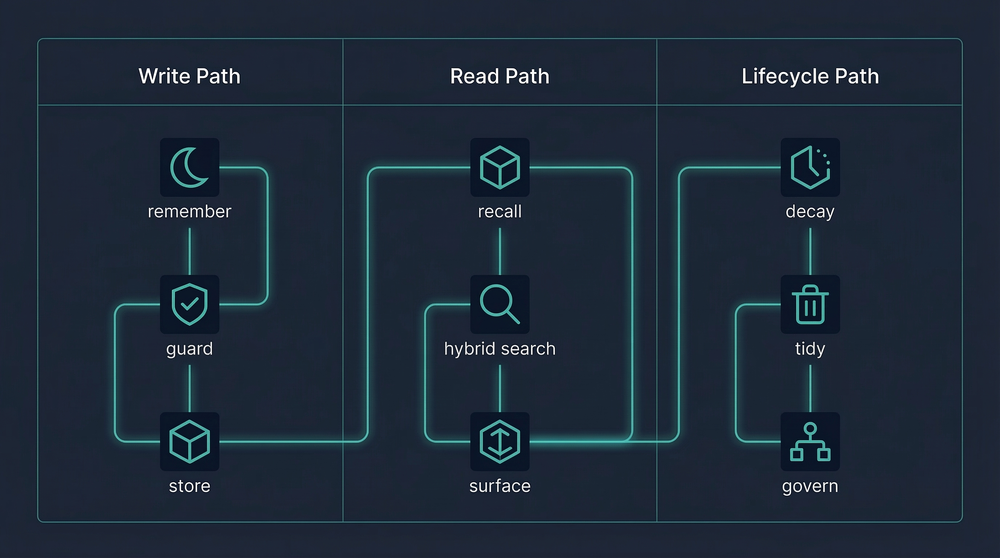
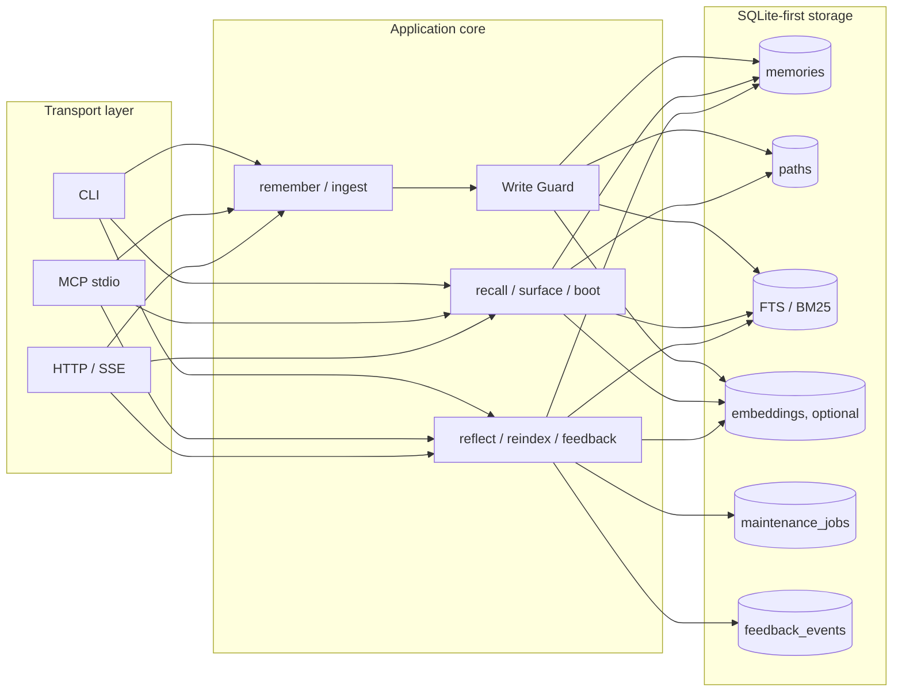
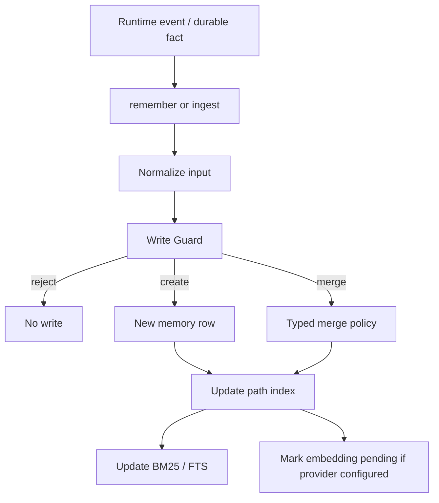
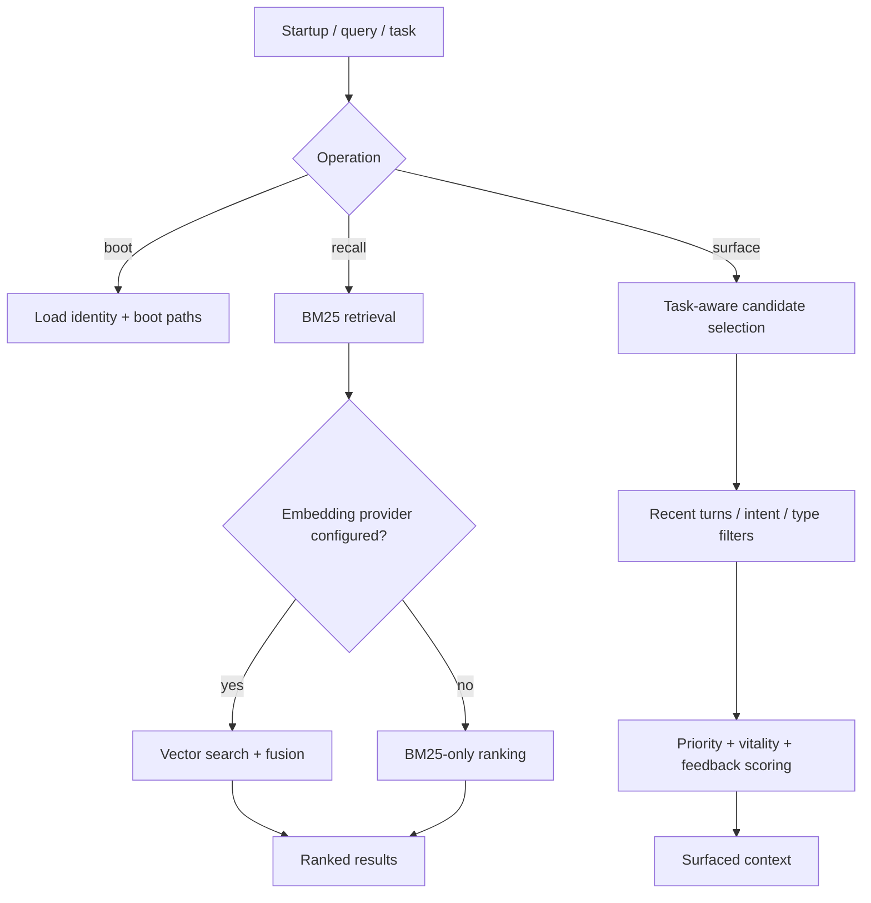
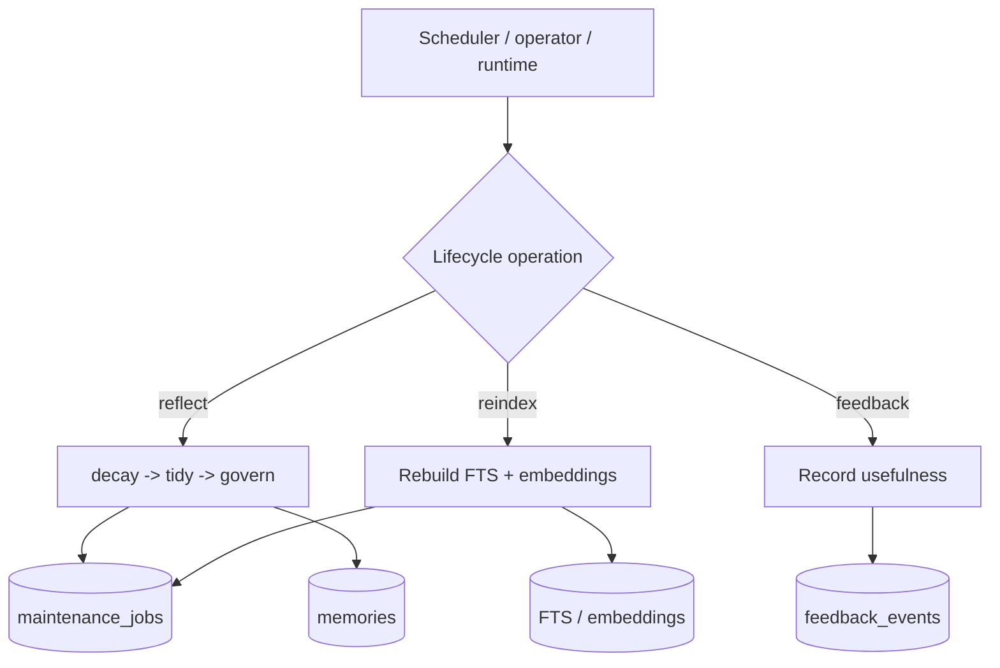

# Architecture Overview

  

AgentMemory v5 is a **SQLite-first, agent-native memory layer** with three
independent but connected paths:

1. **Write path** — capture durable memories safely
2. **Read path** — retrieve or surface the right memories at the right time
3. **Lifecycle path** — keep the memory store healthy over time

The same application core is exposed through **CLI**, **MCP stdio**, and
**HTTP/SSE**.

## System overview

## Write path

The write path exists to answer a hard question safely:

> Should this become memory at all, and if yes, should it create, merge, or be
> rejected?

### What happens here

- **Typed memory model** maps memories into `identity`, `emotion`, `knowledge`,
  and `event`
- **URI paths** give you stable addressing like
  `knowledge://users/alice/preferences/theme`
- **Write Guard** checks for duplicates and near-duplicates before writing
- **Typed merge policy** decides whether similar memories should be updated,
  merged, or left alone
- **Embeddings are optional** — memory creation does not depend on them

### Why this matters

A memory system that only appends will eventually become noisy. The write path
in v4 is built to improve **memory quality at insertion time**, not only at
query time.

## Read path

The read path supports three different retrieval behaviors:

- **`boot`** — load startup identity and pinned context
- **`recall`** — explicit search when the agent is asking a memory question
- **`surface`** — proactive, task-aware context surfacing before a response or
  planning step

### Recall

`recall` is for explicit lookup:

- BM25 is always available
- vector search is added only when an embedding provider is configured
- fusion keeps the system useful even in partial or degraded environments

### Surface

`surface` is for proactive context:

- it can use `task`, `query`, `recent_turns`, `intent`, and `types`
- it is **readonly** and does **not** record access by default
- it uses feedback signals and memory priors to bias what gets surfaced

### Boot

`boot` is the startup path:

- load high-priority identity memories
- optionally load URI paths referenced by `system://boot`
- give the agent a stable self/context seed at session start

## Lifecycle path

AgentMemory is not just a write/read cache. It has a maintenance path for
keeping memory healthy across time.

### Reflect

`reflect` runs lifecycle maintenance phases:

- **decay** — lower vitality over time with type-aware priors
- **tidy** — consolidate or normalize where appropriate
- **govern** — enforce quotas and clean low-value memory over time

In v4, reflect jobs are tracked through **maintenance checkpoints**, which makes
longer jobs more observable and more recovery-friendly.

### Reindex

`reindex` is the maintenance bridge between storage and retrieval:

- rebuilds BM25 / FTS state
- fills or refreshes embeddings when a provider is configured
- supports incremental backfill or full rebuild

### Feedback

`feedback` closes the loop:

- record whether a surfaced or recalled memory was useful
- let future surfacing/ranking be influenced by actual utility

## Optional Markdown workflow

AgentMemory no longer assumes a specific host workflow, but it still supports a
human-editable file layer when you want it.

Typical options:

- use `migrate` to import an existing `MEMORY.md` / journal directory
- use `ingest` to extract structured memories from markdown text
- use watcher-based ingest only when your runtime provides a real workspace to
  watch

This keeps Markdown as an **optional integration choice**, not the definition of
what AgentMemory is.

## Transport choices

| Transport | Best for | Notes |
| --- | --- | --- |
| CLI | local scripts, cron jobs, shell workflows | simplest operational path |
| MCP stdio | tool-using LLM runtimes | great when your host already speaks MCP |
| HTTP/SSE | long-lived services, polyglot runtimes | avoids per-call process spawn overhead |

## Design principles

- **SQLite-first**: local-first, low-friction deployment
- **Optional semantics**: BM25-only remains valid without embeddings
- **Shared application core**: transports do not duplicate memory logic
- **Lifecycle-aware**: memory quality is managed over time, not left to drift
- **Agent-native**: typed memories, boot, surface, and feedback are first-class

## Related docs

- [Generic integration guide](integrations/generic.md)
- [OpenClaw integration guide](integrations/openclaw.md)
- [Migration guide: v3 → v4](migration-v3-v4.md)
